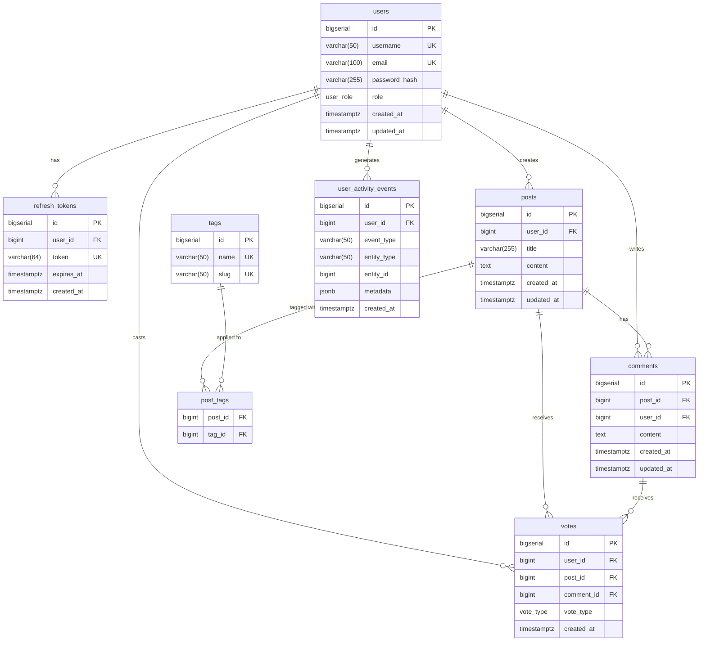

# 🚀 Project Name

## 📌 Overview

This project is a **full-stack monorepo** consisting of:

* Frontend built with Next.js (React)
* Backend built with Spring Boot (Java)
* API Gateway built with Node.js

The architecture separates concerns between UI, business logic, and request routing.

---

## 🏗️ Monorepo Structure

```
/frontend   → Next.js application (React-based UI)
/backend    → Spring Boot REST API (Java)
/gateway    → Node.js API Gateway (Express)
```

---

## ⚙️ Tech Stack

### Frontend

* Next.js
* React
* Tailwind CSS

### Backend

* Spring Boot
* Spring Web
* Spring Data JPA
* Maven

### Gateway

* Node.js
* Express

---

## 🚀 Getting Started

### 1. Clone the repository

```
git clone https://github.com/Dzmitry-Voronka/Project-Wdrozeniowy.git
cd project-name
```

---

## ▶️ Run Frontend

```
cd frontend
npm install
npm run dev
```

Runs on: http://localhost:3000

---

## ▶️ Run Backend

```
cd backend
./mvnw spring-boot:run
```

Runs on: http://localhost:8080

---

## ▶️ Run Gateway

```
cd gateway
npm install
node index.js
```

Runs on: http://localhost:3001 (example)

---

## 🔀 Git Workflow

We follow a simplified Git Flow strategy:

* `main` → production-ready code
* `develop` → integration branch
* `feature/*` → feature branches

### Example:

```
git checkout develop
git checkout -b feature/login-page
git commit -m "Add login page"
git push origin feature/login-page
```

Then create a Pull Request into `develop`.

---

## 📡 Architecture Overview

```
Frontend (Next.js)
        ↓
Gateway (Node.js)
        ↓
Backend (Spring Boot)
        ↓
Database
```

---

## 📄 Environment Variables

Each module may require its own `.env` file.

Example:

```
# frontend/.env
NEXT_PUBLIC_API_URL=http://localhost:3001
```

---

## 🧪 Testing

Backend tests:

```
cd backend
./mvnw test
```

---

## 🗄️ Database Schema



---

## 📦 Future Improvements

* CI/CD pipeline (GitHub Actions)
* API documentation (Swagger)

---

## 👥 Team


---

# Project-Wdrozeniowy